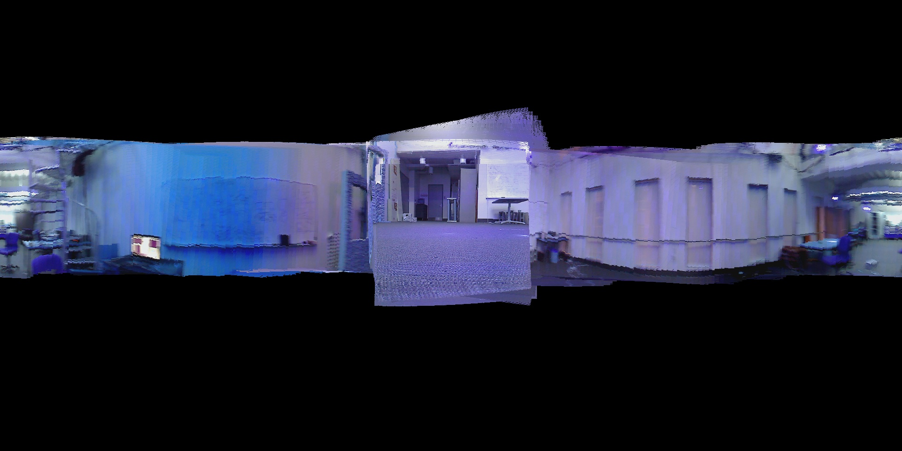
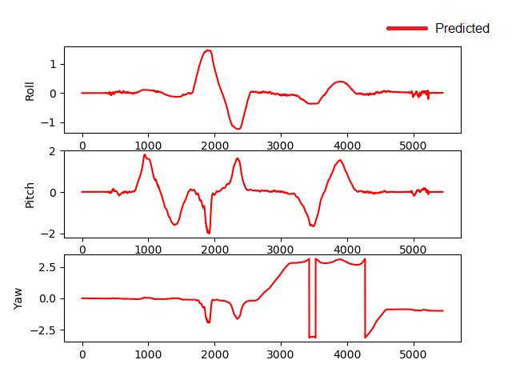
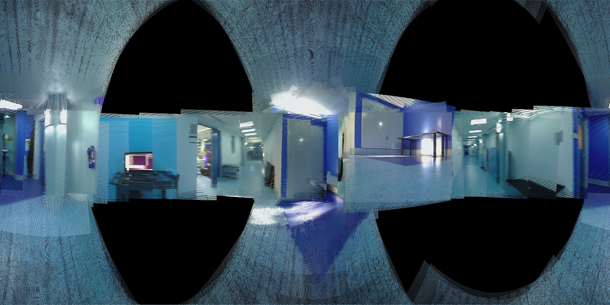
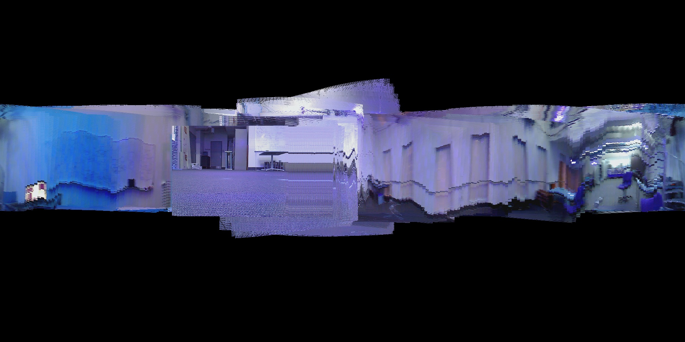

Orientation Estimation using Unscented Kalman Filter
====================================================

In this project, I have implemented Unscented Kalman filter to track three dimensional orientation. This means to estimate the underlying 3D orientation by learning the appropriate model parameters from ground truth data given by a Vicon motion capture system, given IMU sensor readings from gyroscopes and accelerometers. Then be able to generate a real-time panoramic image from camera images using the 3D orientation filter.

* Tested on: Kubuntu 16.04.3, Intel i5-4200U (4) @ 2.600GHz 4GB
* Python 2.7, OpenCV 3.2

Challenge Description
---------------------
* The first part of the problem was to calculate bias and scale parameters for the accelerometer and gyroscope readings.
* Convert IMU readings to quaternions.
* Implement UKF.
* Perform Image Stitching.

# Unscented Kalman filter

### Process Model
The UKF implementation was done using only orientation(gyroscope) in the state vector as the control input: q = [q_0, q_1, q_2, q_3]^T . 
Initialize P (Covariance matrix) as size of 3x3. Similarly, R and Q. R is measurement noise and Q is process noise.
After Kalman filter predict step, new P and state vector q are obtained, which are the used for update step.
Then Sigma Points are obtained by Cholesky decomposition of (P+Q).

### Motion Model
This step deals with updating P and getting new mean state q. Which then leads to obtaining new Sigma Points. This new sigma points are used to calculate multiple covariances, like Pzz, Pxz, and Pvv. 
The next step involves computing K(Kalman Gain) = Pxz Pvv-1 and I(Innovation term) = Accelerometer reading – Mean of Sigma Points
These are used to calculate the P and q for the next stage.

# Results

| Roll-Pitch-Yaw | Vicon Stitch | Estimated Orientation Stitch |
| ----------- | ----------- | ----------- |
|  |  |  |
|  |  |  |

| Test Dataset Roll-Pitch-Yaw | Estimated Orientation Stitch |
| ----------- | ----------- |
|  |  |

### Stitching in action
| Vicon Stitch | Estimated Orientation Stitch |
| ----------- | ----------- |
|  |  |

Instructions
------------
Download:

[Training Dataset](https://upenn.app.box.com/v/ese650Proj2-train)

[Test Dataset](https://upenn.app.box.com/v/ese650Proj2-test)

Place the cam data in "cam" folder, vicon data in "vicon" folder and imu data in "imu" folder.

* Run ukf.py to calculate the predicted values for q state vectors.
	* Outputs of Roll, Pitch and Yaw for predicted vs vicon data will be in folder --> 'Results' with RPY prefix.
	* Outputs of stitching will be in folder --> 'Results' with 'Pano' prefix. 

	NOTE - All variables to toggle stitching, change dataset and change stitching medium(vicon/imu) are in 'ukf.py' at beginning.

* quat_helper.py contains neccessarry functions for quaternion state vector manipulation.

# References
* [A quaternion-based unscented Kalman filter for orientation tracking](http://ieeexplore.ieee.org/document/1257247/)
* [The Kalman Filter](http://www.stat.columbia.edu/~liam/teaching/neurostat-spr12/papers/hmm/KF-welling-notes.pdf)
